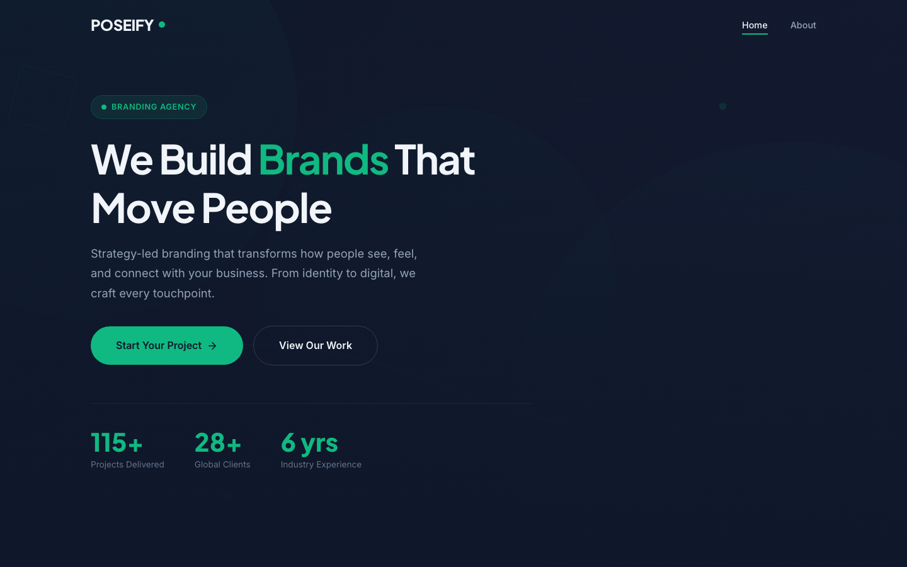

# POSEIFY — Branding Agency HTML Template

A premium, framework-free HTML template for branding and creative agencies. POSEIFY features a striking emerald-on-dark palette, bold typography, and a confident, modern feel built to showcase brand strategy, visual identity, and digital experience work.

## 📸 Screenshot

## 🎨 Design System

| Token | Value | Usage |
|-------|-------|-------|
| `--emerald` | `#10B981` | Primary accent, CTAs, highlights |
| `--emerald-dark` | `#059669` | Hover states, dark-section accents |
| `--dark` | `#0F172A` | Backgrounds, footer, headings |
| `--dark-card` | `#1a2332` | Cards, section surfaces |
| `--text-primary` | `#f1f5f9` | Headings, primary text |
| `--text-secondary` | `#94a3b8` | Body text |
| Headings | Plus Jakarta Sans (600/700/800) | Bold display type |
| Body | Inter (400–700) | Clean geometric sans |

## 📄 Pages

| Page | Description | Sections |
|------|-------------|----------|
| [index.html](index.html) | Home | Hero, services (3), featured work (3), process (Discover → Define → Design → Deliver), testimonials, CTA, contact |
| [about.html](about.html) | Company story | Mission & vision split, values (5), team (4) |

## ⚙️ Tech Stack

- **HTML5** — semantic markup, accessibility-first
- **CSS3** — custom properties, Grid, Flexbox, `clamp()`
- **Vanilla JS** — IntersectionObserver scroll reveals, animated counters, portfolio filtering, contact-form validation, back-to-top
- **Fonts** — Google Fonts (Plus Jakarta Sans + Inter)
- No frameworks, no build step, no dependencies

## 📁 Images

All imagery lives in `assets/img/` — 38 files including service icons (branding, identity, strategy, campaign, digital), work visuals, team portraits (8), testimonials, and layered SVG backgrounds.

---

**Template by uiuxlabz** — framework-free, responsive, production-ready.

### Let's Build Something Together 🚀

[https://tally.so/r/q4q1L9](https://tally.so/r/q4q1L9)
